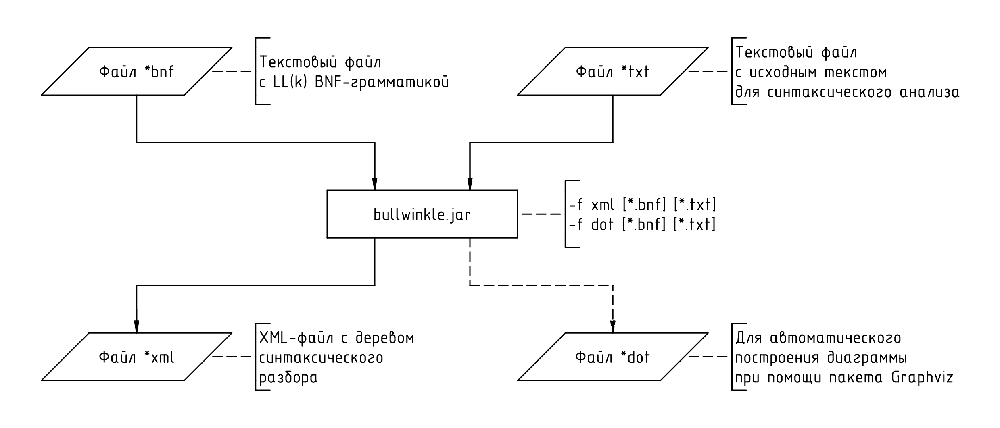
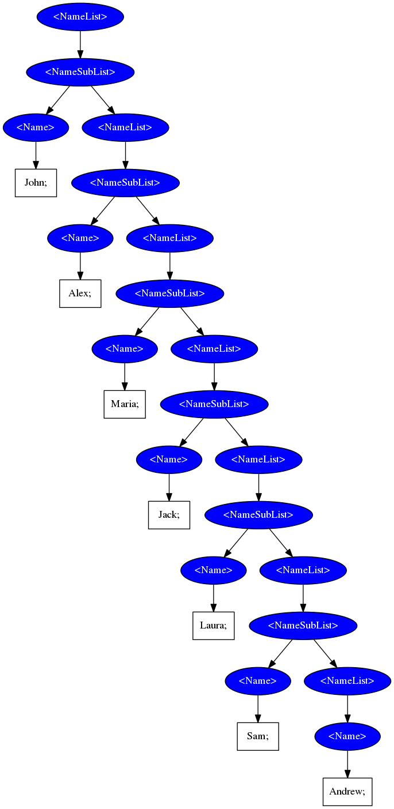
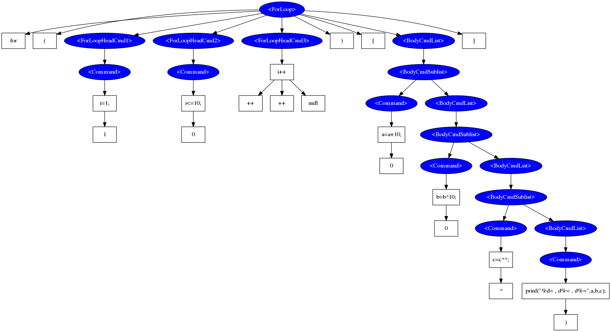
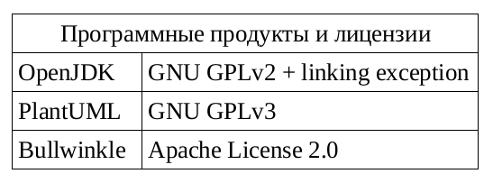
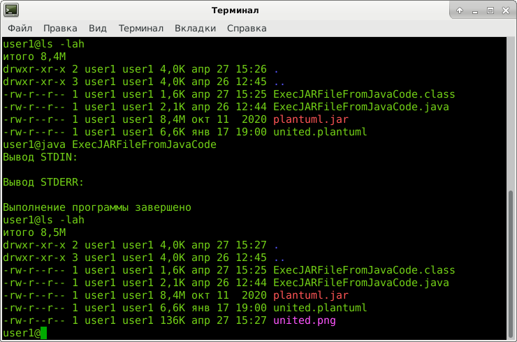
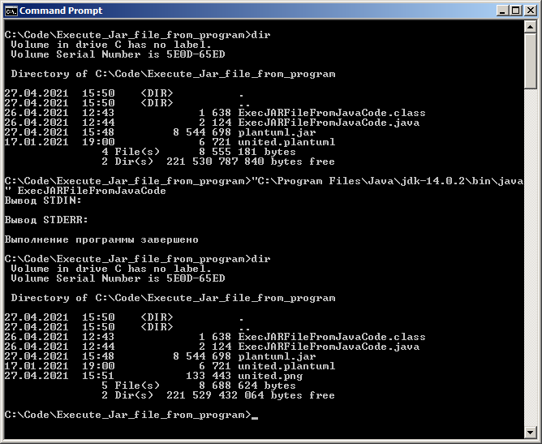
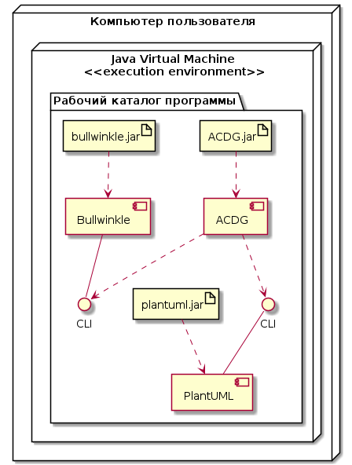
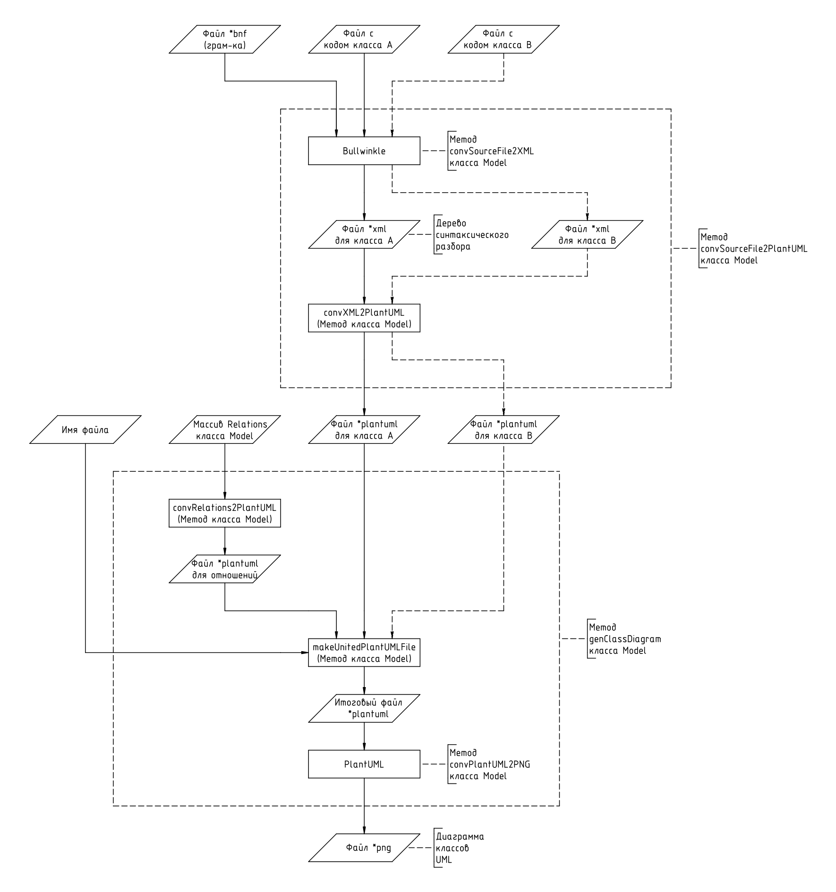
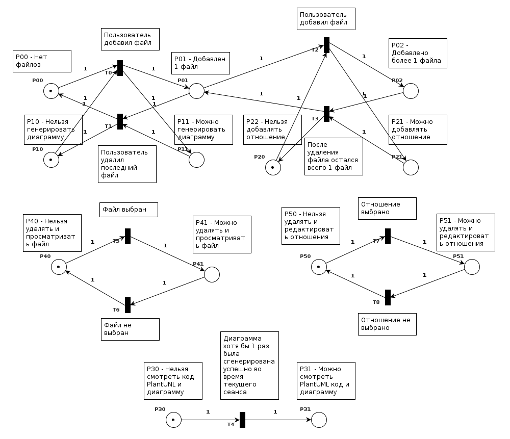
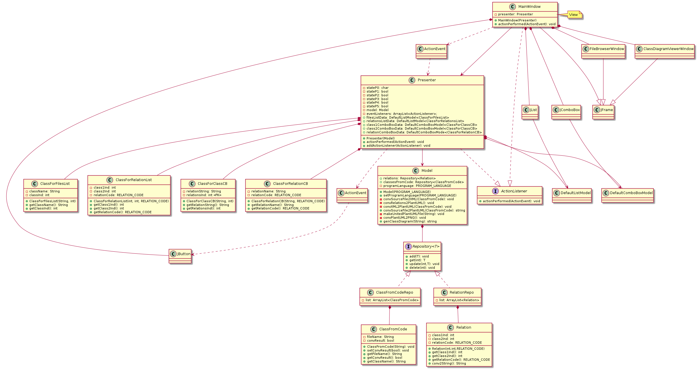

# Программа для автоматической генерации диаграммы классов

Учебное задание по дисциплине "Введение в разработку программного обеспечения".

## Условие задачи

Разработать программу для автоматической генерации диаграммы классов из исходного кода на языке Java, с возможностью подключения дополнительных модулей для обработки кода на языках C# и C++. 

Учесть следующие особенности:

1.	В файлах исходного кода в 1 файле содержится описание лишь 1 класса.
2.	Код не содержит вложенные (nested) классы.
3.	Отношения между классами устанавливаются пользователем вручную.
4.	Методология разработки: RUP.

## Методология разработки RUP

В методологии RUP из-за ее полужесткого принципа большое значение имеет планирование как на уровне проекта, так и на уровне итерации. Принципы такого планирования описаны, например, [здесь](https://cs.nyu.edu/~jcf/classes/CSCI-GA.2440-001_sp16/handouts/PlanningProjWithRUP.pdf)

## Фаза Inception

Задачи: Разработка плана проекта (Project plan).

Алгоритм разработки плана проекта:

1.	Определить наиболее выгодные стороны участия в проекте.
2.	Подготовить экономическое обоснование.
3.	Провести идентификацию и оценку рисков.
4.	Назначить ответственных лиц и утвердить критерии выполнения проекта.
5.	Утвердить состав команды для выполнения проекта.
6.	Подготовить диаграмму прецедентов.
7.	Подготовить план разработки ПО (Software development plan) (в т.ч. определить распределение времени по фазами и число итераций в каждой из них по алгоритму из статьи).

### Диаграмма прецедентов


### Таблица приоритетов прецедентов

Была подготовлена [таблица приоритетов прецедентов](./Inception/UseCasePriority.pdf)

### План проекта

Подготовлен [план проекта](./Inception/ProjectPlan.pdf)

### Функциональные требования

1.	Лицензия: GNU GPLv3.
2.	ЯП: Java (OpenJDK).
3. 	Библиотека модульного тестирования: JUnit.
4.	Средство для генерации UML-диаграмм: PlantUML.
5.	Программа должна работать на компьютерах с ОС Windows7 и Debian GNU/Linux 9.0 и старше.

## Фаза Elaboration

### Итерация 1

#### Подбор синтаксического анализатора

В качестве синтаксического анализатора был выбран [Bullwinkle](https://github.com/sylvainhalle/Bullwinkle), написанный на **Java**, и распространяемый под лицензией **Apache2**, совместимой с лицензией **GPLv3**. 

Одно из достоинств Bullwinkle - возможность работы в standalone-режиме при помощи CLI-интерфейса:



#### Примеры использования Bullwinkle

##### Компиляция и сборка Bullwinkle

Выполнить команду: 

```
git clone https://github.com/sylvainhalle/Bullwinkle
```

Далее, в корневом каталоге репозитория нужно выполнить команду

```
ant
```

предварительно установив данный пакет.

##### Синтаксический анализ списка имен

Попробуем провести синтаксический анализ [списка имен](./Elaboration/1/Names.txt), разделенных символом `;`.

Отметим некоторые особенности грамматики для данного синтаксического анализатора:

* Стартовый символ - символ в левой части первого правила;
* Правила вида `<List> := <Item> <List> | <Item>;` из-за особенностей грамматики использовать **нельзя** (см. альтернативную структуру на диаграмме ниже);
* Символы в правиле обрабатываются слева-направо (если не подходит - берется следующий);
* Терминальные символы, задающиеся регулярными выражениями, нужно всегда начинать с символа `^`.

Файл с грамматикой в форме Бэкуса-Наура для этой задачи будет выглядеть [так](./Elaboration/1/Grammar_for_list.bnf).

Скопируем `bullwinkle.jar` в каталог с файлами грамматики и исходного текста, и выполним синтаксический анализ, сохранив результат в формате, который использует пакет **Graphviz**:

```
java -jar bullwinkle.jar -f dot Grammar_for_list.bnf Names.txt >> NamesList.dot
```

Теперь сгенерируем диаграмму для визуализации дерева синтаксического разбора при помощи **Graphviz**:

```
dot -Tpng NamesList.dot -o NamesList.png
```



При помощи такой грамматики удается провести анализ списка с числом имен не более 20. Для увеличения глубины перебора можно в правило для **SubList** добавлять случаи с большим количеством **Name**:

```
<NameSubList>:= <Name> <Name> <Name> <Name> <Name> <NameList> |
 <Name> <NameList>;
```

При помощи такого подхода удалось в экспериментальных целях провести анализ списка имен с числом имен значительно превышающим 100.

Также **Bullwinkle** способен сохранять дерево синтаксического разбора в [XML-файл](./Elaboration/1/NamesList.xml).

##### Синтаксический анализ цикла For

На этот раз попробуем провести синтаксический анализ цикла **For** на языке **C**. 

Сначала был подготовлен [тестовый пример](./Elaboration/1/For_Loop_Test.txt). Затем описана [грамматика](./Elaboration/1/For_Loop.). Дерево синтаксического разбора представлено ниже:

.

Не совсем понятно, чем обусловлено появление дополнительных токенов, вроде "1" или "0", но **результат синтаксического анализа можно считать удовлетворительным**. 

#### Выбор лицензии для конечного программного продукта

##### Использованные программные продукты и их лицензии

Таблица, сопоставляющая использованные программные продукты с их лицензиями, представлена ниже:



##### Совместимость лицензий

О совместимости лицензий можно почитать, например, в [статье на Habr.ru](https://habr.com/ru/post/284390/).

##### Classpath exception в OpenJDK

О том, что такое **classpath exception (linking exception)** в лицензии для OpenJDK можно почитать на [StackExchange](https://opensource.stackexchange.com/questions/515/what-is-a-class-path-exception).

Очевидно, что при использовании **OpenJDK** можно разрабатывать программные продукты с **любой лицензией**, если:

1.	С кодом **OpenJDK** на этапе сборки взаимодействует **независимый модуль**, т.е. модуль, не являющийся производным от библиотек, входящих в состав **OpenJDK**, и не основанный на них. 
2.	Выполняются условия лицензий всех **других независимых модулей**, входящих в проект.

##### Лицензия GNU GPLv3


Если включать jar-файлы **PlantUML** и **Bullwinkle** в итоговый архив, то, основываясь на данных о совместимости лицензий, наиболее оптимальным видится использование лицензии [GPLv3](https://www.gnu.org/licenses/gpl-3.0.html). О некоторых ее преимуществах можно почитать на сайте [GNU](https://www.gnu.org/licenses/rms-why-gplv3.html). Обновление лицензии GPLv2 до GPLv3 [допустимо](https://www.gnu.org/licenses/gpl-faq.html#v3HowToUpgrade). 

##### Как применить лицензию GPLv3 к своей программе?
[Официальная инструкция](https://www.gnu.org/licenses/gpl-howto.html) по применению лицензий GNU к своим программам. 

Чтобы **применить лицензию GNU GPLv3** к своей программе необходимо:

1.	Добавить файл `COPYING` с [копией лицензии](https://www.gnu.org/licenses/gpl-3.0.txt) в корневой каталог проекта.
2.	Добавить уведомление о лицензии в каждый файл исходного кода проекта.

### Итерация 2

#### MWE, демонстрирующий выполнение jar-файлов из кода java

Подготовлен [MWE](./Elaboration/2/Execute_Jar_file_from_program/ExecJARFileFromJavaCode.java), демонстрирующий выполнение jar-файлов из кода java.

Суть эксперимента:

1.	Скомпилировать код MWE (файл **ExecJARFileFromJavaCode.java**)
2.	Поместить в каталог с MWE файл **plantuml.jar**, скачанный с официального сайта, и какой-нибудь файл с корректным кодом **PlantUML**.
3.	Запустить файл **ExecJARFileFromJavaCode.class**
4.	В каталоге MWE должен появиться файл **png** с диаграммой

##### Результат для ОС Debian GNU/Linux 9.12 "Stretch"



##### Результат для ОС Windows7



##### Выводы

В результате экспериментов можно сделать вывод о том, что идея, демонстрируемая при помощи данного MWE, вполне жизнеспособна и может послужить основой для разработки архитектуры данного приложения.

#### Разработка программной архитектуры

Основа для разработки программной архитектуры - паттерн **MVP**.

##### Объединенная диаграмма компонентов/развертывания UML



##### Блок-схема обработки данных (ГОСТ 19.701-90)

Для функционального описания бизнес-логики, реализованной внутри класса **Model**, подготовлена блок-схема обработки данных согласно ГОСТ 19.701-90.



##### Прототип GUI для главного окна (View)

При помощи **PlantUML** подготовлен прототип GUI для главного окна приложения.


##### Логика работы Presenter

Логика работы **Presenter** описана при помощи сетей Петри.



##### Диаграмма классов



##### Реляционная модель


