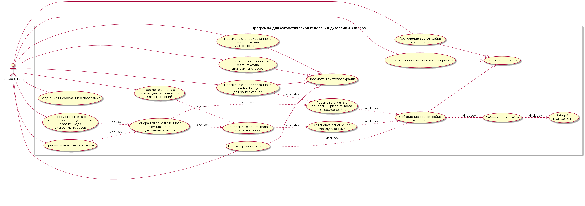

# Программа для автоматической генерации диаграммы классов

Учебное задание по дисциплине "Введение в разработку программного обеспечения".

## Условие задачи

Разработать программу для автоматической генерации диаграммы классов из исходного кода на языке Java, с возможностью подключения дополнительных модулей для обработки кода на языках C# и C++. 

Учесть следующие особенности:

1.	В файлах исходного кода в 1 файле содержится описание лишь 1 класса.
2.	Код не содержит вложенные (nested) классы.
3.	Отношения между классами устанавливаются пользователем вручную.
4.	Методология разработки: RUP.

## Методология разработки RUP

В методологии RUP из-за ее полужесткого принципа большое значение имеет планирование как на уровне проекта, так и на уровне итерации. Принципы такого планирования описаны, например, [здесь](https://cs.nyu.edu/~jcf/classes/CSCI-GA.2440-001_sp16/handouts/PlanningProjWithRUP.pdf)

## Фаза Inception

Задачи: Разработка плана проекта (Project plan).

Алгоритм разработки Project plan:

1.	Определить наиболее выгодные стороны участия в проекте.
2.	Подготовить экономическое обоснование.
3.	Провести идентификацию и оценку рисков.
4.	Назначить ответственных лиц и утвердить критерии выполнения проекта.
5.	Утвердить состав команды для выполнения проекта.
6.	Подготовить диаграмму прецедентов.
7.	Подготовить план разработки ПО (Software development plan) (в т.ч. определить распределение времени по фазами и число итераций в каждой из них по алгоритму из статьи).

### Диаграмма прецедентов

### Таблица приоритетов прецедентов

Была подготовлена [таблица приоритетов прецедентов](./Inception/UseCasePriority.pdf)

### План проекта

Подготовлен [план проекта](./Inception/ProjectPlan.pdf)

### Функциональные требования

1.	Лицензия: GNU GPL2.
2.	ЯП: Java (OpenJDK).
3. 	Библиотека модульного тестирования: JUnit.
4.	Средство для генерации UML-диаграмм: PlantUML.
5.	Программа должна работать на компьютерах с ОС Windows7 и Debian GNU/Linux 9.0 и старше.

