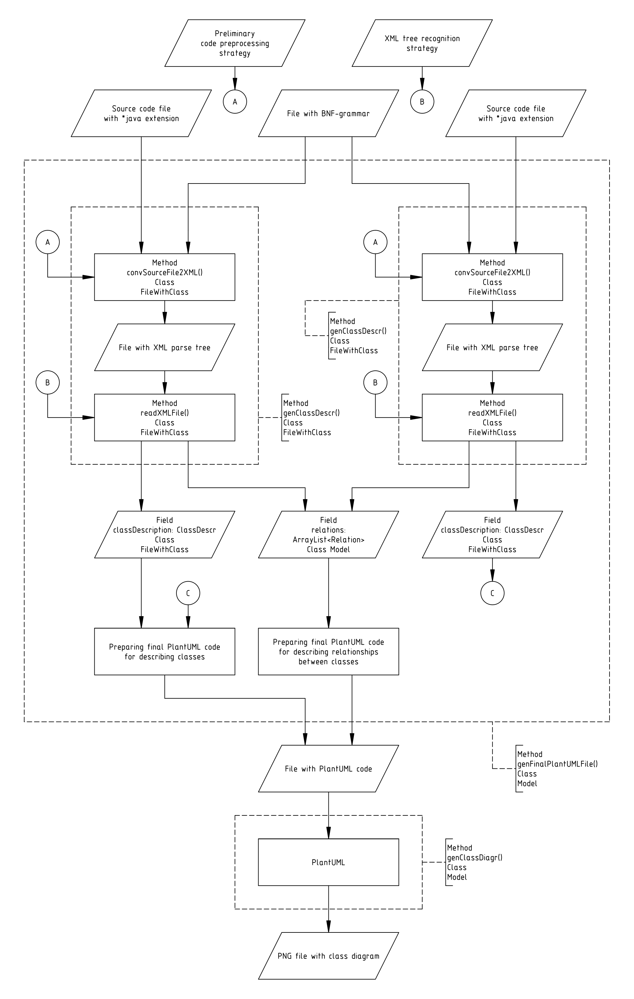
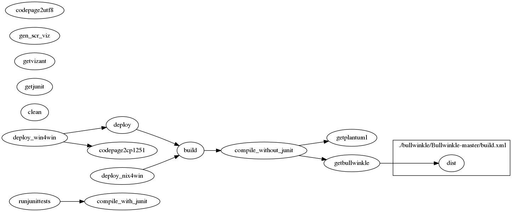

# ACDG - An automatic class diagram generator

## What is ACDG?

ACDG is a free cross-platform tool under **GPLv3** license that allows you to generate UML class diagrams from source files. It is written in Java and uses [Bullwinkle](https://github.com/sylvainhalle/Bullwinkle) and [PlantUML](https://plantuml.com) as standalone JAR files. It currently only supports Java for source files, but support for other languages can be added. 

## What can it do?

Currently only **Java** supported. All files must comply with [Java Code Conventions](https://www.oracle.com/technetwork/java/codeconventions-150003.pdf). Nested classes and interfaces currently not supported.

See UML class diagram of its own code generated by ACDG. 

### Special mode of operation: user-defined programming language

An additional programming language can be added without changing the ACDG code. For example, let's build a class diagram based on the [TestClassA.java](./descr/TestClassA.java) file with the Java source code. 

#### The contents of the "Bin" directory

#### Required command line arguments

This example uses the [java.bnf](./src/java.bnf) grammar file as well as one of the XML tree processing strategies available in the program (for the Java language). In the future, perhaps a more versatile strategy will be developed specifically for this mode. 

#### The resulting UML class diagram

## How does it work?

### UML deployment diagram

### Dataflow diagrams

See dataflow diagrams created in accordance to russian GOST 19.701-90

#### convSourceFile2XML method

## How to use it?
Make sure you have Java and [Apache Ant](https://ant.apache.org/) installed! It works fine with OpenJDK 11.0.6 and Ant 1.9.9. You also need to download archive with ACDG from GitHub or clone this repository with git.

### Installation

#### Unix-like OS

Automatic generation of an archive **ACDG.zip** with a directory containing everything you need to use ACDG:

	ant deploy

This command is suitable for any OS with the UTF-8 encoding. It must be run in the root directory of the archive.

#### Old Windows versions (before 10)

At first execute this:

	ant codepage2cp1251

then execute this:

	ant deploy
	
##### Rebuilding
	
Attention! Use only this command to rebuild:

	ant deploy

### Self-test

This command generates a UML class diagram for its own code

	java -jar ACDG.jar -test

The **ACDG.jar** file is located in the **bin** directory. All output files will be placed in the **output** directory.

### Quick compilation and creation of a jar file

Quick code compilation and JAR file creation without installing dependencies for debugging purposes:

	ant build_debug

### CLI reference

See file [README.TXT](./data/README.TXT) or use option `-help`.

	java -jar ACDG.jar -help

### Other Ant targets

See the visualization of [build.xml](build.xml) script prepared with the [Vizant](http://vizant.sourceforge.net/). More information can be found in the **build.xml** file.

## Additional information

### How to add a new programming language?

A new programming language needs to be added to **AvailablePLs** class. You will need a BNF-grammar text file, a preliminary procedural source code processing strategy and a XML-tree recognition strategy. You will also need to edit the **SimpleClient** class. 

### How to add a graphical interface?

You must develop a new client class instead of SimpleClient or you can use CLI.

### How to compile and run built-in JUnit tests?

Get **JUnit.jar**:

	ant getjunit

Compile code with it:

	ant compile_with_junit

To run them, use this command:

	ant runjunittests
	
You can use it if you want to change the code. 

## Acknowledgements

In the spring of 2021, as part of the study of the discipline *"Technology of programming"* at VSTU, Cand.  Sci.  (Engineering), Head  of  the  Department  of  Computers  and  Systems, **A. E. Andreev**, had  suggested that I develop a program that would automatically generate a UML class diagram based on source code files. The task was difficult, but I managed to complete it. I thank him for such an interesting task, which brought me a lot of pleasure.

I would like to express my gratitude to the following professors who gave me the knowledge that allowed me to complete this task: Cand.  Sci.  (Engineering), Head  of  the  Department  of  Computers  and  Systems,  **A. E. Andreev** (Java, OOP, UML, Agile software development), Cand. Sci. (Engineering), associate professor, **A. A. Sokolov** (Git and Markdown), Cand. Sci. (Engineering), associate professor, **V. L. Berdnik** (Compilers) and Cand. Sci. (Engineering), associate professor, **V. S. Polyakov** (Declarative programming).
